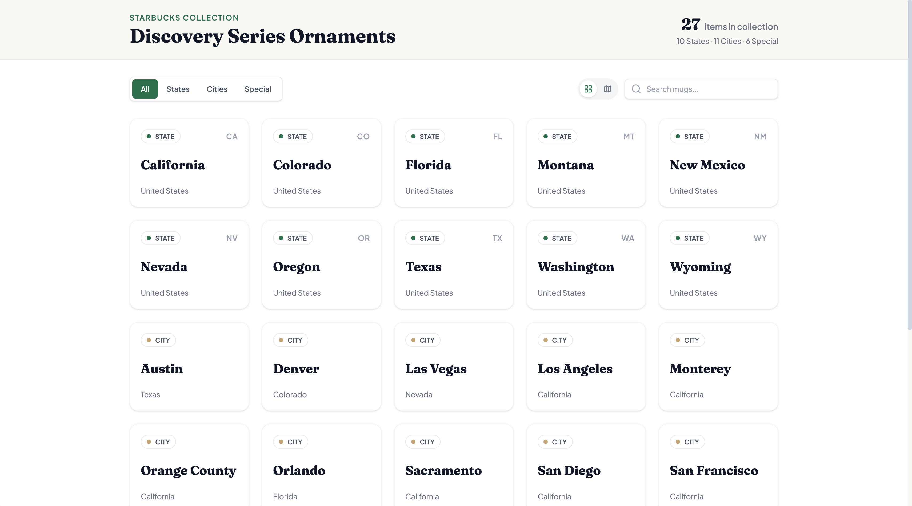

# MugArchive

[](LICENSE)
[](https://github.com/DW1209/MugArchive/actions/workflows/deploy.yml)
[](https://github.com/DW1209/MugArchive/commits/main)


> A modern, interactive collector's app for tracking your Starbucks Discovery Series mug collection.



🔗 **Live demo:** [dw1209.github.io/MugArchive](https://dw1209.github.io/MugArchive/)

## ✨ Features
- 🗺️ **Interactive US Map** — hover or tap states and markers, with a legend
- 🖼️ **Grid View** — browse mug cards with category badges, state abbreviations, and location context
- 🔄 **Dual View Modes** — Grid and Map, switched via an animated segmented toggle
- 🔍 **Smart Filtering** — search by name and filter by category, synced across both views
- 📊 **Collection Dashboard** — total item count and category breakdown at a glance
- 📱 **Responsive UI** — layout adapts across mobile and desktop

## 🛠️ Tech Stack
| Category | Technology |
|---|---|
| Framework | React `^19.2.0` (React DOM `^19.2.0`) |
| Build tool | Vite `^7.2.4` |
| Styling | Tailwind CSS v4 (`@tailwindcss/vite`, no `tailwind.config.js`) |
| Backend / data | Supabase `@supabase/supabase-js ^2.112.4` — hosted Postgres + auto REST API |
| Icons | lucide-react `^0.563.0` |
| Linting | ESLint — React Hooks + React Refresh plugins |

The frontend stays a static site on GitHub Pages; mug data is served from a Supabase Postgres table and fetched at runtime. If Supabase is unconfigured or unreachable, the app falls back to the dataset bundled in `src/data/mugs.js`, so it always runs.

## 🚀 Getting Started
### Prerequisites
- Node.js: `20.19+`
- npm package manager

### Installation
1. Clone the repository:
```bash
git clone https://github.com/DW1209/MugArchive.git
cd MugArchive
```
2. Install dependencies:
```bash
npm install
```
3. Configure Supabase — optional, skip it and the app runs against the bundled `src/data/mugs.js` dataset instead:

   <details>
   <summary>🗄️ Backend setup (Supabase)</summary>

   Data is served from a Supabase Postgres table. To stand up your own:
   1. Create a free Supabase project; note its **Project URL**, **anon** key, and **service_role** key (Project Settings → API).
   2. Run `supabase/schema.sql` in the Supabase SQL editor to create the `mugs` table and its read-only RLS policy.
   3. Seed the table from the bundled dataset (the service_role key bypasses RLS — keep it secret, never commit it):
      ```bash
      SUPABASE_URL=https://your-project.supabase.co \
      SUPABASE_SERVICE_ROLE_KEY=your-service-role-key \
      node scripts/seed.mjs
      ```
   4. Put the **Project URL** and **anon** key in `.env.local` for local dev (copy `.env.example` first: `cp .env.example .env.local`).
   5. For the deployed site, add `VITE_SUPABASE_URL` and `VITE_SUPABASE_ANON_KEY` as repository **Actions secrets** (Settings → Secrets and variables → Actions). The deploy workflow injects them at build time. The anon key is safe to expose publicly because the table is read-only via RLS.

   </details>

4. Start the development server:
```bash
npm run dev
```
The application will be available at `http://localhost:5173/MugArchive/`

## 📜 Available Scripts
- `npm run dev` — Start the development server with hot module replacement
- `npm run build` — Build the project for production
- `npm run preview` — Preview the production build locally
- `npm run lint` — Run ESLint to check code quality

## 🧩 Data Customization
The live data source is the Supabase `mugs` table — there is no in-app write UI or auth, so all editing happens directly in the Supabase Studio table editor (enforced by RLS: a `select`-only policy, no insert/update/delete policy exists at all). Category determines the required fields:
- `State`: just `id` (two-letter state code) and `name`.
- `City`: needs `stateId`, `lat`, `lon`.
- `Special`: needs `lat`, `lon`; `group` is optional and clusters multiple entries into a single map marker.

`src/data/mugs.js` mirrors this dataset and acts as the seed source (`scripts/seed.mjs`) and offline fallback. Keep it in sync if you want the fallback to match, and re-run the seed script to rebuild the table.

## 📚 Additional Documentation

<details>
<summary>🗂️ Project structure</summary>

```
├── public/
│   └── mug.png                     # Tab icon
├── src/
│   ├── components/
│   │   ├── ControlsBar.jsx         # Search, category filter, and view toggle
│   │   ├── Header.jsx              # Application header with stats
│   │   ├── MugCard.jsx             # Individual mug card component
│   │   ├── MugGrid.jsx             # Grid layout for mug cards
│   │   └── USMap.jsx               # Interactive US map + legend
│   ├── data/
│   │   ├── mugs.js                 # Mugs dataset (Supabase seed source + offline fallback)
│   │   └── usStates.js             # US states data (static, frontend-only)
│   ├── hooks/
│   │   └── useMugs.js              # Fetches mugs from Supabase (realtime), falls back to mugs.js
│   ├── lib/
│   │   └── supabase.js             # Supabase client (configured from VITE_SUPABASE_* env vars)
│   ├── utils/
│   │   └── projection.js           # Coordinate projection (lat/lon to map)
│   ├── main.jsx                    # React entry point
│   ├── App.jsx                     # Root application component
│   └── index.css                   # Global styles
├── scripts/
│   └── seed.mjs                    # One-time: seed the Supabase mugs table from mugs.js
├── supabase/
│   └── schema.sql                  # mugs table schema + read-only RLS policy
├── .env.example                    # Template for Supabase env vars (copy to .env.local)
├── index.html                      # HTML entry point
├── package.json                    # Dependencies and scripts
├── vite.config.js                  # Vite configuration
└── eslint.config.js                # ESLint configuration
```

</details>

<details>
<summary>🗃️ Data structure</summary>

Each mug, as consumed by the app (the shape returned by `useMugs`, mirrored in `src/data/mugs.js`), holds the following fields:

| Field | Description |
|---|---|
| `id` | Unique identifier (slug or state code) |
| `name` | Mug name/location |
| `category` | `"State"`, `"City"`, or `"Special"` |
| `stateId` | (Optional) Associated state code for cities/special items |
| `lat`/`lon` | (Optional) Geographic coordinates for map plotting |
| `group` | (Optional) Collection group name (e.g., "Disney World") that clusters entries into a single map marker |

</details>

<details>
<summary>🌐 Browser support</summary>

Tested and working in Chrome/Edge, Firefox, and Safari, including mobile (iOS Safari, Chrome Mobile).

</details>

<details>
<summary>🎨 Map data attribution</summary>

- Base SVG map is sourced from [amCharts SVG Maps](https://www.amcharts.com/svg-maps/)
- Starbucks Discovery Series is a trademark of Starbucks Corporation

</details>

## 📄 License
This project is licensed under the MIT License. See [LICENSE](LICENSE) for details.
